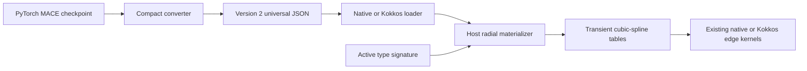

# Universal Compact MACE and MACEField Migration

Date: 2026-07-18

## Executive summary

Symmetrix previously converted a MACE checkpoint for one explicitly selected
set of elements. Conversion sampled the radial networks for every unordered
element pair and persisted complete cubic-spline tables. A model retained for
`S` elements consequently stored O(S^2) radial data, so a universal checkpoint
could not practically be converted once and reused across arbitrary supported
compositions.

The new format stores the compact definition of the radial computation instead:
the Bessel basis, polynomial cutoff, optional Agnesi distance transform,
element-aligned covalent radii, and effective MLP weights. At runtime, the
native or Kokkos evaluator discovers the active composition, materializes the
same spline representation for only those `A` active elements, and continues
to use the existing table-driven hot kernels.

The result is a version 2 universal artifact that can be converted once and
reused for every composition supported by its retained element list. This is
an intentional producer-default change: older Symmetrix readers cannot consume
version 2 output unless legacy `pair-splines` is requested. The
79-element MACEField checkpoint used for validation produces a 258,289,094-byte
minified JSON file. Legacy unversioned pair-spline JSON remains supported.

## Motivation

The legacy pair-table representation was efficient during evaluation but made
model conversion composition-specific. For every retained pair, conversion
executed the PyTorch radial embedding and radial MLPs at all spline nodes, then
stored both values and derivatives for:

- `R0`, the first interaction radial outputs;
- `R1`, the second interaction radial outputs;
- `A0`, when the first interaction uses density scaling; and
- `A1`, when the second interaction uses density scaling.

The number of unordered pairs is `S(S+1)/2`. Universal models with dozens of
elements therefore incurred quadratic conversion time, file size, JSON parsing
cost, and resident table memory even when a calculation used only two or three
elements.

The migration retains the performance property that motivated pair tables:
radial MLPs are not evaluated per neighbor edge. They are evaluated once per
active element pair when the composition changes.

## Old and new designs

| Concern | Legacy pair-splines, version 1 | Compact universal, version 2 |
|---|---|---|
| Default species | Explicit subset required by the public function | Omitted species retains every checkpoint element |
| Persisted radial data | Values and derivatives for every retained pair | Basis, cutoff, transform, radii, and radial MLPs |
| Radial disk scaling | O(S^2 N F) | O(S + W) |
| Runtime radial memory | All retained pair tables | O(A^2 N F) active tables |
| Conversion work | Samples every retained pair | Serializes shared parameters once |
| Composition changes | Require another converted model | Replace the transient active cache |
| Edge evaluation | Cubic-spline lookup | Same cubic-spline lookup |
| JSON identification | Unversioned, interpreted as version 1 | `symmetrix_format_version: 2` and `radial_representation: compact` |
| Unsupported radial architecture | Converter behavior depended on sampling compatibility | Descriptive rejection with an explicit `pair-splines` fallback |
| File encoding | Human-indented JSON | Minified JSON by default |

Here `S` is the number of retained model species, `A` is the number of active
species in a calculation, `N` is the spline-node count, `F` is the number of
radial outputs, and `W` is the compact radial-network parameter count. The
complete artifact remains O(S) because non-radial tensors and optional
covalent radii are retained per element.

## Architecture



The persisted model and transient tables have distinct responsibilities:

1. The JSON preserves enough information to reconstruct radial outputs for any
   retained element pair.
2. The host materializer performs infrequent setup work when the sorted active
   type signature changes.
3. The native and Kokkos compute paths use compact integer mappings and spline
   tables, preserving their previous per-edge execution model.

## Format migration

### Legacy radial fields

An unversioned file is interpreted as format version 1. Its radial section
contains fields such as:

```json
{
  "radial_spline_h": 0.0196,
  "radial_spline_values_0": [],
  "radial_spline_derivs_0": [],
  "radial_spline_values_1": [],
  "radial_spline_derivs_1": []
}
```

Optional density interactions add separate `A0_*` and `A1_*` arrays. Newly
generated pair-spline files also record `radial_spline_min`, `A0_spline_min`,
and `A1_spline_min`. Older files omit these fields and retain their historical
zero-origin interpretation.

### Compact radial fields

Version 2 replaces those pair arrays with one `compact_radial` object:

```json
{
  "symmetrix_format_version": 2,
  "radial_representation": "compact",
  "compact_radial": {
    "spline_grid_min": 1e-12,
    "num_spline_points": 256,
    "basis": {
      "type": "bessel",
      "weights": [],
      "prefactor": 1.0
    },
    "cutoff": {
      "type": "polynomial",
      "r_max": 5.0,
      "p": 5
    },
    "distance_transform": {
      "type": "none"
    },
    "networks": {
      "R0": {"shape": [], "weights": [], "activation": "silu", "activation_scale": 1.0},
      "R1": {"shape": [], "weights": [], "activation": "silu", "activation_scale": 1.0}
    }
  }
}
```

An Agnesi model uses `distance_transform.type: agnesi` and stores `a`, `q`,
`p`, and covalent radii aligned with the top-level `atomic_numbers`. Density
models add `A0` and/or `A1` networks with `postprocess: tanh-square`.

All non-radial data is extracted as before. This includes atomic energies,
element embeddings, interaction/product weights, readouts, ZBL data, and the
MACEField field-coupling tensors.

## Converter implementation

### Supported compact architecture

Compact conversion currently accepts:

- `RadialEmbeddingBlock`;
- `BesselBasis`;
- an applied `PolynomialCutoff`;
- no distance transform or `AgnesiTransform`;
- e3nn `FullyConnectedNet` radial and density networks;
- unit e3nn input/output variances;
- no layer biases;
- normalized SiLU on hidden layers; and
- no output activation before optional density `tanh(square(x))` processing.

Validation is deliberately strict. An unsupported architecture raises an
error that recommends `radial_format="pair-splines"` with an explicit species
list. This prevents a compact artifact from silently changing model semantics.

### Effective MLP weights

e3nn stores a layer weight as `[input, output]` and applies fan-in/variance
normalization during evaluation. The converter folds that normalization into
the serialized matrix and transposes it to the output-major layout used by the
existing Symmetrix batched MLP evaluator:

```text
W_effective = transpose(W_e3nn / sqrt(h_in * var_in / var_out))
```

Hidden layers apply:

```text
x_next = activation_scale * SiLU(W_effective * x)
```

The output layer is linear. For density networks, the materializer then applies
`tanh(x^2)` before spline construction.

### Radial reconstruction

For each active pair and spline node, the host materializer:

1. Selects the physical distance or applies the pair-dependent Agnesi
   transform using the mean covalent radius.
2. Evaluates each Bessel feature as the stored prefactor times
   `sin(weight * transformed_r) / transformed_r`.
3. Multiplies the basis by the stored polynomial cutoff evaluated at the
   physical distance.
4. Evaluates R0, R1, and optional A0/A1 networks in batches.
5. Derives nodal slopes with an O(N) tridiagonal solver matching SciPy's
   not-a-knot left and clamped right boundary conditions.

The final right derivative is zero. Spline objects preserve the positive grid
origin and clamp interval selection at the exact cutoff, avoiding an endpoint
index past the final interval.

## Runtime migration

### Active type signature

Both evaluators expose:

- `prepare_active_types(node_types)`; and
- read-only `active_atomic_numbers`.

Preparation converts model type indices into a sorted, unique signature. If
the signature is unchanged, no materialization occurs. Otherwise, all new
tables and mappings are built before replacing the old cache. The cache is
replaced rather than accumulated, preventing long-running universal workflows
from eventually recreating the full quadratic table set.

The evaluator is stateful. Concurrent host calls on one evaluator instance are
not supported.

### Native evaluator

The native implementation materializes unordered pair tables and creates a
global-to-active vector of length `S`, with `-1` for inactive types. A single
validated helper maps both endpoint types and computes the triangular active
pair index. Forward, reverse, density-scaled, and field-response paths use this
helper.

Legacy files install an identity mapping and load every serialized table, so
their compute path remains compatible.

### Kokkos evaluator

The Kokkos setup runs on the host and transfers ready-to-use coefficients to
Kokkos views. It creates:

- ordered R0 coefficients for `A*A` pairs, because R0 is fused with endpoint-
  dependent H0 and linear-up weights;
- unordered R1, A0, and A1 coefficients for `A(A+1)/2` pairs; and
- an O(S) `type_to_active` device view.

Device kernels map both endpoints before table indexing. Python preparation
uses the union of center and neighbor types, which also supports partial graphs
where a type appears only in the neighbor list. Existing branch-free
table evaluation is retained for legacy and compact models. A fence precedes
view replacement.

Finite-difference field responses recompute their unperturbed baseline for each
request. Arbitrary Kokkos views do not provide a reliable graph identity, so
this prevents a same-composition calculation from reusing a baseline belonging
to different geometry or topology. The extra evaluation affects response
requests only, not ordinary field energy/force calculations.

Kokkos energy and force output buffers are resized exactly, allowing one
calculator to move from a larger to a smaller structure without exposing stale
outputs.

### ASE and pybind

Python bindings prepare active types before top-level calculations and directly
exposed radial operations. The center/neighbor union is deduplicated in one
linear graph scan before the bounded species signature is sorted. Numeric
arrays crossing the MACE native or Kokkos bindings are force-cast to contiguous
storage, so strided NumPy inputs are accepted safely instead of having their
strides silently discarded.

The ASE calculator validates atomic-number support and maps ASE numbers to model
type indices. Each top-level binding prepares the union of center and neighbor
types once, avoiding duplicate active-type discovery in the ASE layer.
Reassigning one calculator from AlN to MgO therefore changes
`active_atomic_numbers` from `[7, 13]` to `[8, 12]` instead of accumulating four
types.

### LAMMPS

LAMMPS has a different cache lifetime. `pair_coeff` maps every LAMMPS atom type
to a model type and prepares that complete fixed set once. Internal C++ compute
methods do not shrink the cache to the species present on one MPI rank. This is
required because another rank or a later domain decomposition can contain a
mapped type absent from the current rank's local atoms.

The native and Kokkos pair styles validate that exactly one element mapping is
provided per LAMMPS atom type. The Kokkos mapping view is sized by the LAMMPS
type count rather than by the number of model elements.

## Public interface changes

Python conversion now defaults to:

```python
extract_mace_data(
    model,
    species=None,
    head=None,
    num_spline_points=256,
    radial_format="compact",
)
```

CLI conversion of every checkpoint element is:

```bash
symmetrix_extract_mace --model my-mace.model
```

This writes `my-mace-universal.json`. A compact subset remains available by
specifying elements. Legacy output is explicit:

```bash
symmetrix_extract_mace \
    --model my-mace.model \
    --atomic-numbers 1 8 \
    --radial-format pair-splines \
    --num-spline-points 256
```

Compact CLI output is minified because whitespace becomes significant for a
large universal JSON artifact. Pair-spline output remains indented for legacy
usability. The four-node minimum applies only to compact output; explicit
pair-spline extraction retains the legacy SciPy support for two- and three-node
grids.

## Migration procedure

### Converting an existing checkpoint

1. Use a MACE version capable of loading the checkpoint, including its selected
   multi-head or MACEField class.
2. Run the converter without a species list to retain all checkpoint elements.
3. Select the required head explicitly for multi-head checkpoints.
4. Load the resulting JSON once in native or Kokkos Symmetrix.
5. Exercise at least two different supported compositions with the same
   evaluator and confirm `active_atomic_numbers` changes.
6. Compare energies, forces, stress, and any field-response properties against
   the PyTorch checkpoint before deployment.

Example for the universal MACEField test checkpoint:

```bash
symmetrix_extract_mace \
    --model MACEField-MH-0-omat-dielectric.model \
    --head mp-dielectric \
    --output macefield-dielectric-universal.json
```

### Retaining legacy behavior

No existing JSON migration is required. Unversioned files load as format
version 1. To regenerate a composition-specific artifact, pass an explicit
element list and `--radial-format pair-splines`.

### Deployment considerations

- Account for one-time active-cache materialization separately from warm
  evaluation timing.
- Reuse one evaluator sequentially when compositions change; do not share it
  concurrently between host threads.
- In LAMMPS, map every declared atom type in `pair_coeff`, even if the initial
  structure does not contain that type.
- Keep model downloads in an external cache. Neither checkpoint files nor
  generated universal JSON artifacts belong in the source repository.
- Use float64 for the current MACEField Kokkos response path. Normal MACE keeps
  float32 Kokkos support, including conversion from checkpoints trained in
  float32 because conversion promotes parameters before serialization.

## Compatibility scope

The updated runtime remains backward compatible with existing unversioned JSON
artifacts. Producer behavior is not backward compatible by default:
`extract_mace_data(model, species)` and the equivalent CLI invocation now emit
compact version 2 instead of pair arrays. Callers that inspect legacy dictionary
keys or deploy to an older Symmetrix reader must request `pair-splines`.

The added default constructor parameters preserve common source calls to
`CubicSpline` and `RadialFunctionSetKokkos`, but this change does not claim C++
ABI compatibility for external libsymmetrix consumers.

## Compatibility matrix

| Input/runtime | Native | Kokkos float64 | Kokkos float32 |
|---|---:|---:|---:|
| Version 1 MACE | Supported | Supported | Supported |
| Version 1 MACEField | Supported where field coupling is present | Supported | Not supported |
| Version 2 compact MACE | Supported | Supported | Supported |
| Version 2 compact MACEField | Supported | Supported | Not supported |
| ASE composition reuse | Supported | Supported | Supported for normal MACE |
| LAMMPS fixed mapping | Implemented, execution unverified | Implemented, execution unverified | Implemented for normal MACE, execution unverified |

The compact converter supports only the validated architecture described above.
Pair-spline extraction remains the compatibility path for other radial models.

## Verification results

The implementation has been checked with the following results:

- A no-species MACEField conversion retains 79 elements and produces a
  258,289,094-byte minified artifact with no legacy radial pair arrays.
- Compact and corrected pair-spline radial values agree at approximately
  `3.2e-13` for R0 and `1.1e-13` for R1 in the normal MACE checks.
- Their radial derivatives agree at approximately `4.7e-12` for R0 and
  `1.5e-12` for R1, tighter than the requested tolerances.
- Old unversioned JSON loads unchanged and agrees with compact AlN energy to
  approximately `8.3e-12` in native and Kokkos evaluation.
- One ASE calculator evaluates AlN and MgO sequentially and replaces its active
  signature for native and Kokkos execution.
- Partial-graph bindings include neighbor-only species in active preparation,
  and native/Kokkos R1 outputs agree for that case.
- A same-composition geometry change before a Kokkos field Hessian agrees with
  a fresh evaluator, preventing stale finite-difference baselines.
- The native MACEField finite-difference and PyTorch-reference suite passes all
  11 tests, including field energy/forces and H1 transformation consistency.
- MACEField energy, forces, stress, polarization, BECs, and polarizability retain
  their existing reference tolerances.
- Normal MACE float32 compact versus legacy energy and force differences are
  about `1.5e-5`, within the CI tolerance of `1e-4`.
- Fresh Serial and OpenMP CMake builds complete successfully.
- Measured warm compact/legacy timing ratios are approximately 1.03 for native,
  1.00 for Kokkos Serial, and 0.99 to 1.00 for Kokkos OpenMP.

CUDA compilation/execution and actual LAMMPS execution were not available in
the local environment. Their code paths and CI setup were reviewed, but those
results must not be represented as locally executed validation.

## CI and fixture handling

The MACE-enabled workflow now:

- caches downloaded checkpoints under `~/.cache/symmetrix/test-models`;
- verifies the release MACEField checkpoint by SHA-256 and replaces corrupt
  cached copies;
- verifies that the published MACEField checkpoint can be obtained;
- runs compact MACEField converter and ASE integration tests on the current
  MACE dependency lane;
- compares compact and pair-spline normal MACE through ASE; and
- performs both float64 and float32 normal-MACE comparisons.

The MACEField LAMMPS test accepts `SYMMETRIX_MACEFIELD_MODEL`, otherwise uses
the external cache and release URL. No user-specific path, downloaded model, or
generated artifact is tracked by the repository. In GitHub CI, a missing or
invalid MACEField download fails the LAMMPS job instead of skipping every
integration case.

## Risks and constraints

1. **Architecture coverage.** Compact version 2 intentionally supports a
   limited radial architecture. Strict rejection protects numerical fidelity;
   pair-splines remains the fallback.
2. **Stateful cache.** Concurrent calls can race with cache replacement. The
   supported contract is sequential host use of an evaluator.
3. **Setup latency.** The first calculation for a new composition materializes
   O(A^2) tables. Benchmarks must distinguish this from warm evaluation.
4. **JSON size.** The universal artifact is now O(S), but JSON parsing and
   decimal encoding still produce a large file. A binary container is a
   separate future improvement.
5. **Device validation.** Serial and OpenMP are locally verified. CUDA remains
   dependent on compilation and runtime testing in a CUDA-capable environment.
6. **MPI validation.** LAMMPS cache ownership is designed around the fixed
   `pair_coeff` mapping, but multi-rank execution still requires an installed
   LAMMPS test environment.

## Independent review disposition

Four read-only reviews independently covered converter/schema behavior, native
and LAMMPS execution, Kokkos portability, and API/CI/test coverage. Confirmed
issues found during review were addressed as follows:

| Finding | Disposition |
|---|---|
| Four-node validation broke legacy two/three-node pair splines | Validation scoped to compact output; regression test added |
| Neighbor-only types could map to `-1` in Kokkos | Bindings now prepare the center/neighbor union; native/Kokkos partial-graph regression added |
| Kokkos response reused a baseline from changed geometry | Response requests now recompute the unperturbed baseline; same-composition geometry regression added |
| Direct native compact R0/R1 could dereference empty tables | Descriptive pre-preparation guards added |
| R0/R1 output widths were incompletely checked | Native and Kokkos active materialization now validate expected widths |
| Remaining strided NumPy paths discarded strides | Numeric native/Kokkos inputs now use contiguous force-casts |
| Positive-origin scalar spline lower boundary differed from other backends | Positive-origin splines clamp consistently; zero-origin legacy behavior retained |
| Kokkos force output retained a previous larger allocation | Public force output is resized exactly |
| ASE and bindings both discovered active types | ASE duplicate preparation removed |
| LAMMPS model download could skip all cases in a green CI job | CI now fails on missing/invalid model; release artifact is SHA-256 verified |
| Pinned MACE CI lane was upgraded before extraction | The upgrade was removed so each matrix lane tests its declared version |

The converter default change is intentional rather than a defect. Updated
readers load old artifacts, but older readers require explicit pair-spline
output. Remaining review gaps are CUDA execution, actual single/multi-rank
LAMMPS execution, full 79-element serialized round-trip testing in CI, and C++
ABI validation for external consumers.

## Verification provenance

Build and focused test commands used for the final local verification are:

```bash
cmake --build /tmp/symmetrix-compact-build -j4
cmake --build /tmp/symmetrix-compact-openmp-build -j4

SYMMETRIX_MACEFIELD_MODEL=/path/to/MACEField-MH-0-omat-dielectric.model \
python -m pytest -q symmetrix/test/test_macefield_native.py

SYMMETRIX_MACEFIELD_MODEL=/path/to/MACEField-MH-0-omat-dielectric.model \
python -m pytest -q \
  symmetrix/test/test_extract_mace_data.py \
  symmetrix/test/test_symmetrix_calc.py::test_compact_macefield_calculator_replaces_active_composition_cache
```

The exact file-size and warm-timing values above came from local exploratory
runs using temporary artifacts and are not CI performance thresholds. They are
reported as measurements, not as reproducible benchmark guarantees.

## Implementation map

| Area | Primary files |
|---|---|
| Converter and schema | `symmetrix/source/symmetrix/extract_mace_data.py` |
| CLI | `symmetrix/source/symmetrix/cli/extract_mace.py` |
| Shared materializer | `libsymmetrix/source/compact_radial.hpp`, `libsymmetrix/source/compact_radial.cpp` |
| Native cache and loader | `libsymmetrix/source/mace.hpp`, `libsymmetrix/source/mace.cpp` |
| Kokkos cache and loader | `libsymmetrix/source/mace_kokkos.hpp`, `libsymmetrix/source/mace_kokkos.cpp` |
| Spline domain support | `libsymmetrix/source/cubic_spline*`, `libsymmetrix/source/radial_function_set_kokkos*` |
| Python bindings and ASE | `symmetrix/source/cpp/mace*.cpp`, `symmetrix/source/symmetrix/symmetrix_calc.py` |
| LAMMPS | `pair_symmetrix/pair_symmetrix_mace*.cpp` |
| Tests and CI | `symmetrix/test`, `pair_symmetrix/test`, `.github/workflows/ci.yaml` |

## Conclusion

The migration moves composition dependence from persistent model conversion to
an explicitly managed transient cache. It preserves the existing spline-based
runtime while allowing one universal Symmetrix artifact to serve every
composition in the retained element set. Versioned loading preserves existing
artifacts, while the explicit legacy output option supports older consumers.
Strict converter validation makes unsupported cases fail visibly rather than
producing a numerically ambiguous compact model.
